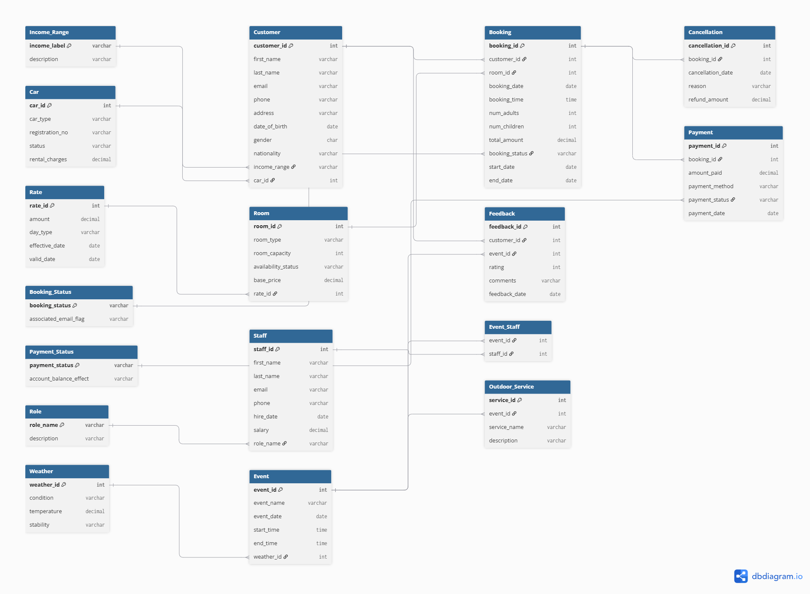

# 🏨 Resort Booking & Event Management Database

A complete PostgreSQL database system for managing resort operations: customer bookings, room allocation, event scheduling, staff management, payments, cancellations, car rentals, weather-based services, and feedback.


*Entity Relationship Diagram — 18 tables with full relationships*

---

## 📌 Features

- **18 normalized tables** (up to 3NF)
- **3 SQL Views** for real-time reporting
- **4 Triggers** enforcing business rules automatically
- **3 Functions** for automated calculations
- **2 Stored Procedures** for booking workflows
- **9 Performance Indexes** on frequently queried columns
- **10+ Analytical Queries** demonstrating JOINs, aggregates, and CASE logic

---

## 🛠️ Tech Stack

- **Database:** PostgreSQL 16
- **Client:** DBeaver 26.2.2
- **Design:** dbdiagram.io
- **Normalization:** 1NF → 3NF

---

## 🗄️ Database Schema


*All 18 tables organized in PostgreSQL*

### Tables Created

| Table | Purpose |
|-------|---------|
| `customer` | Guest information and profiles |
| `booking` | Room reservations with dates and status |
| `room` | Room inventory with types and capacities |
| `rate` | Dynamic pricing by day type |
| `payment` | Payment transactions |
| `cancellation` | Cancellation records with refunds |
| `event` | Event scheduling |
| `event_staff` | Many-to-many staffing assignments |
| `staff` | Employee records |
| `role` | Staff role definitions |
| `weather` | Weather conditions for outdoor events |
| `outdoor_service` | Weather-dependent services |
| `feedback` | Customer reviews |
| `car` | Rental car inventory |
| `income_range` | Customer income brackets |
| `booking_status` | Booking state lookup |
| `payment_status` | Payment state lookup |

---

## 📊 Sample Query Result


*Multi-table JOIN showing booking details with customer and room info*

**Query used:**
```sql
SELECT 
    b.booking_id,
    c.first_name || ' ' || c.last_name AS customer,
    r.room_type,
    b.start_date,
    b.end_date,
    (b.end_date - b.start_date) AS nights,
    b.total_amount,
    b.booking_status
FROM Booking b
JOIN Customer c ON b.customer_id = c.customer_id
JOIN Room r ON b.room_id = r.room_id
ORDER BY b.booking_id;
